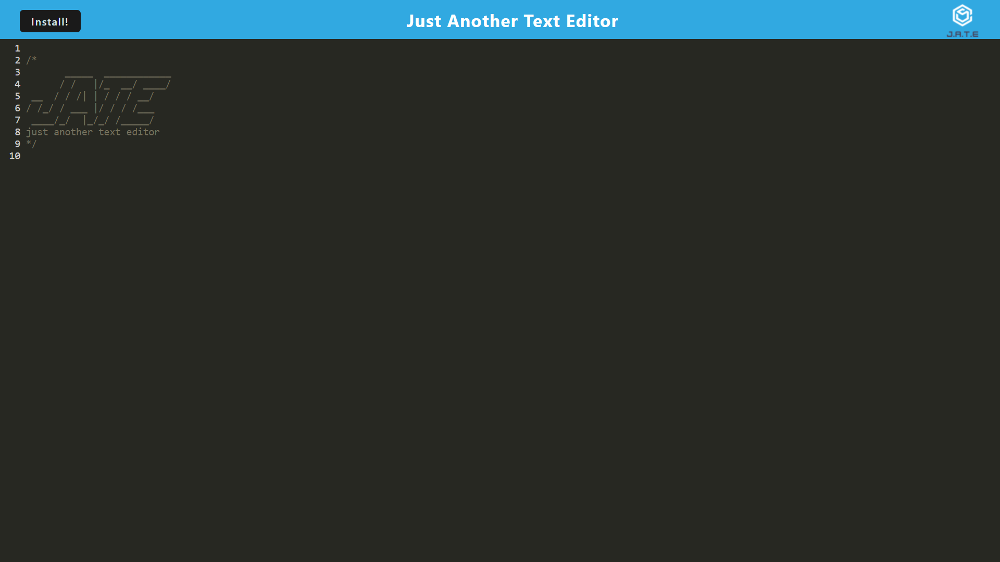

# My_Notes

My Notes is a text editor Progressive Web App for storing and retreiving logic, algorithms , markdown, or any other useful code snippets. It will store and overwrite and changes to the text in real-time. Any updates will get placed into localStorage and automatically be added to IndexDB once the user clicks off the editor.

My Notes was created with the following technologies; CodeMirror, Webpack, and IndexDB.

## Table of Contents
* [Access](#Access)
* [Screenshot](#Screenshot)
* [Questions](#Questions)

## Access 

The app can be accessed by following [this link](https://code-snippets-6mtb.onrender.com).  It can be used in browser or it can be downloaded for offline use. Hit the "Intall!" button and confirm the prompt for the app to download.

## Screenshot

## Questions 

Reach out at my [GitHub!](https://github.com/JustDesmarais)
